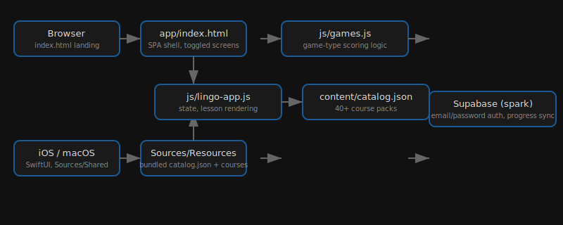

# Lexly

  [](https://github.com/nulljosh/lexly)

A gamified language and skill learning app. Web + native iOS/macOS.

Live at [lexly.heyitsmejosh.com](https://lexly.heyitsmejosh.com).

<p>
  
  
</p>

## Platforms

| Platform | Name | App ID | Status |
|---|---|---|---|
| Web | Lexly | — | Live |
| iOS | Lexly (6783501611) | com.nulljosh.lingo | v1.1.0, build 202607030001 attached, awaiting submission |
| macOS | Lexly Mac (6783501927) | com.nulljosh.lingo.mac | v1.1.0, build 202607030001 attached, awaiting submission |

## Features

- 40+ courses: languages, programming, math, science, school (PC12, AP Bio 12), skills
- Spaced repetition review, XP, streaks, hearts, achievements
- Speech recognition for language courses
- Native iOS/macOS: SF Symbol icon chips, spring animations, per-unit progress
- Email/password auth via Supabase (spark project), progress syncs across platforms
- Light/dark theme, PWA-ready

## Structure

```
index.html              # web app shell
css/lingo.css           # all styling
js/lingo-app.js         # state, auth/profile, lesson rendering
js/games.js             # game-type logic
content/catalog.json    # course catalog
content/courses/        # individual course packs (JSON)
ios/Sources/Shared/     # SwiftUI views (cross-platform)
ios/Sources/iOS/        # iOS entry point
ios/Sources/macOS/      # macOS entry point
school/                 # BC curriculum HTML masterclass pages
```

## Running locally

```bash
npx serve .
```

## iOS/macOS

```bash
cd ios && xcodegen generate
# archive Lexly-iOS or Lexly-macOS, upload via asc-xcode-build skill
```

## Testing

```bash
node tools/validate-catalog.js
```

## Architecture



## Roadmap

See `roadmap.md` for the current open items (iOS/Mac 1.1.0 rejection fixes, completion-tracking bug, Stripe Pro unlock, UX backlog).
