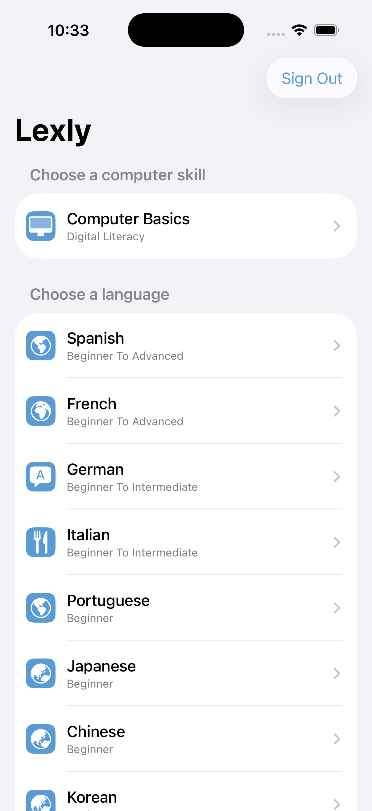
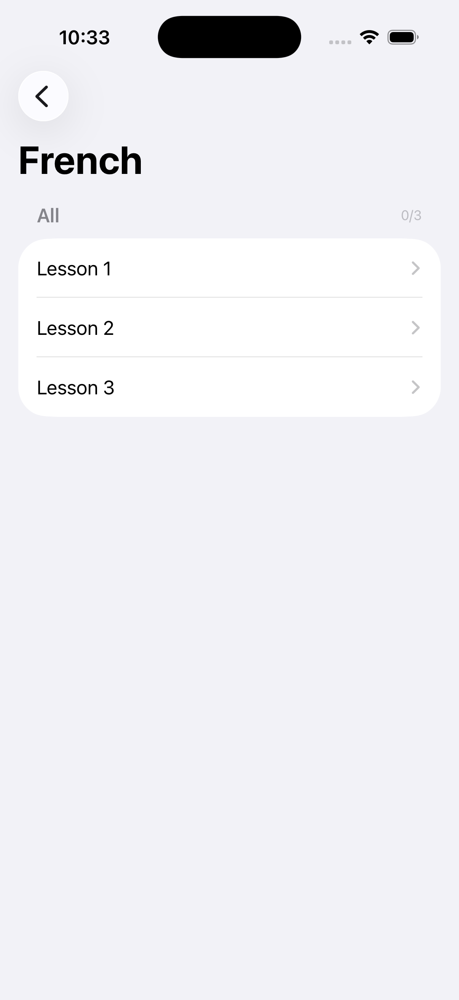

# Lexly

  [](https://github.com/nulljosh/lexly)

A gamified language and skill learning app. Web + native iOS/macOS.

Live at [lexly.heyitsmejosh.com](https://lexly.heyitsmejosh.com).

<p>
  
  
</p>

## Platforms

| Platform | Name | App ID | Status |
|---|---|---|---|
| Web | Lexly | — | Live |
| iOS | Lexly (6783501611) | com.nulljosh.lingo | v1.1.0, build 202607030001 attached, awaiting submission |
| macOS | Lexly Mac (6783501927) | com.nulljosh.lingo.mac | v1.1.0, build 202607030001 attached, awaiting submission |

## Features

- 40+ courses: languages, programming, math, science, school (PC12, AP Bio 12), skills
- Spaced repetition review, XP, streaks, hearts, achievements
- Speech recognition for language courses
- Native iOS/macOS: SF Symbol icon chips, spring animations, per-unit progress
- Email/password auth via Supabase (spark project), progress syncs across platforms
- Light/dark theme, PWA-ready

## Structure

```
index.html              # web app shell
css/lingo.css           # all styling
js/lingo-app.js         # state, auth/profile, lesson rendering
js/games.js             # game-type logic
content/catalog.json    # course catalog
content/courses/        # individual course packs (JSON)
ios/Sources/Shared/     # SwiftUI views (cross-platform)
ios/Sources/iOS/        # iOS entry point
ios/Sources/macOS/      # macOS entry point
school/                 # BC curriculum HTML masterclass pages
```

## Running locally

```bash
npx serve .
```

## iOS/macOS

```bash
cd ios && xcodegen generate
# archive Lexly-iOS or Lexly-macOS, upload via asc-xcode-build skill
```

## Testing

```bash
node tools/validate-catalog.js
```

## Roadmap

- [x] `Lingo-macOS` target already exists in `ios/project.yml` and builds clean locally (`xcodebuild -scheme Lingo-macOS`) — no separate `macos/` dir needed.
- [x] ASC version records bumped 1.0 → 1.1.0, latest build (202607030001) attached to both apps.
- [x] Fixed builds attached to 1.1.0: iOS 202607060001, Mac 202607060002 (rebuilt+uploaded 2026-07-06, VALID).
- [x] SUBMITTED 2026-07-06: both 1.1.0 versions WAITING_FOR_REVIEW. Availability (all 175 territories) set via public v2 appAvailabilities API (no web session needed); App Privacy (email+user ID, app functionality) published via asc web; demo account, copyright, free pricing set via API.
- [x] 2026-07-07: web landing page + `/app/` split shipped (see below); native iOS/macOS SwiftUI UI still on the pre-redesign look.
- [x] Native iOS/macOS visual parity checked 2026-07-07: SwiftUI app already uses matching `#5B9BD5` accent throughout (tint, buttons, selection); native apps correctly use system fonts (SF Pro) rather than the web's Fraunces/DM Sans. No drift — nothing to fix here.
- [ ] Fresh screenshots + resubmission: would need a real build+run+fastlane cycle and supersedes the 1.1.0 currently WAITING_FOR_REVIEW — confirm with Josh before bumping/resubmitting.

## Roadmap (added 2026-07-09)
- Stripe Pro unlock: migration + edge functions (stripe-checkout, stripe-webhook) written, not deployed. Needs STRIPE_SECRET_KEY/STRIPE_PRO_PRICE_ID/STRIPE_WEBHOOK_SECRET secrets + `supabase link --project-ref tjsxsqlxjmanwvmywwvw` + `supabase db push` + `supabase functions deploy`. User providing Stripe test key next session.
- Brilliant/Duolingo parity: streaks, XP, hearts, SRS review already shipped. Not yet added: daily XP goal ring, guided step-by-step hint problems (Brilliant-style).
