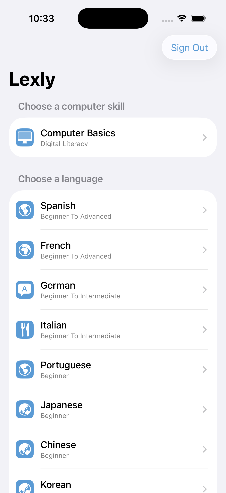
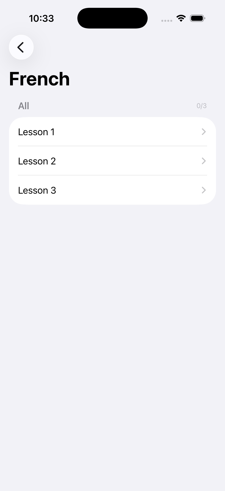
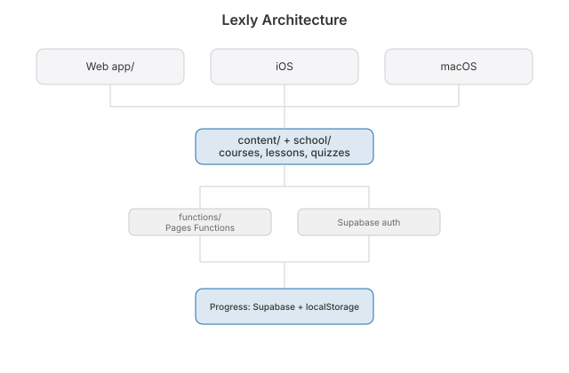

# Lexly

  [](https://apps.apple.com/app/id6783501611) [](https://github.com/nulljosh/lexly)

Learn a language, or anything else, five minutes at a time. Streaks, hearts, XP. Web, iOS, macOS, and Apple Watch.

Live at [lexly.heyitsmejosh.com](https://lexly.heyitsmejosh.com) · [App Store](https://apps.apple.com/app/id6783501611)

<p>
  
  
</p>

## Platforms

| Platform | Name | App ID | Status |
|---|---|---|---|
| Web | Lexly |: | Live |
| iOS | Lexly (6783501611) | com.nulljosh.lingo | **1.1.3 live on the [App Store](https://apps.apple.com/app/id6783501611)**; 1.1.5 rejected under Guideline 4.3(a): see roadmap.md |
| macOS | Lexly (6783501611, merged app record) | com.nulljosh.lingo | 1.1.4 live; 1.1.5 in review |
| watchOS | Lexly Watch | com.nulljosh.lingo.watchos | Standalone companion, not yet submitted |

Versions here go stale fast. `asc versions list --app 6783501611` is the truth.

The old standalone "Lexly Mac" record (6783501927) is a dead orphan. It cannot be deleted and an Apple support case is open. Ignore it.

## Features

- 40+ courses. Languages, programming, math, science, school (PC12, AP Bio 12), skills
- 2,600+ exercises. About 2,000 of them across 12 languages
- Multiple choice, word bank, fill in the blank, matching pairs, listening
- Spaced repetition, XP, streaks, hearts, achievements
- Speech recognition in the language courses
- Native iOS and macOS: SF Symbol chips, spring animations, progress per unit
- Apple Watch companion: streak, XP, hearts, and due reviews at a glance
- Email and password auth through Supabase (the spark project). Progress syncs everywhere
- Light and dark. Installs as a PWA

## Structure

```
index.html              # web app shell
css/lingo.css           # all styling
js/lingo-app.js         # state, auth/profile, lesson rendering
js/games.js             # game-type logic
content/catalog.json    # course catalog
content/courses/        # individual course packs (JSON)
scripts/build-language-course.mjs  # generates language packs from Tatoeba
ios/Sources/Shared/     # SwiftUI views (cross-platform)
ios/Sources/iOS/        # iOS entry point
ios/Sources/macOS/      # macOS entry point
watchos/                # standalone watchOS companion (own xcodegen project)
school/                 # BC curriculum HTML masterclass pages
```

## Running locally

```bash
npx serve .
```

## iOS/macOS

```bash
cd ios && xcodegen generate
# archive Lexly-iOS or Lexly-macOS, upload via asc-xcode-build skill
```

## watchOS

Standalone companion app, no login flow of its own -- pair it by pasting a Supabase access
token copied from the phone into the Settings tab. Reads `lingo_progress` (streak, XP,
hearts, due reviews) directly from the shared `spark` Supabase project.

```bash
cd watchos && xcodegen generate
```

## Testing

```bash
node tools/validate-catalog.js
```

## Architecture



## Roadmap

See `roadmap.md` for current open items.

## Whitepaper

[Technical whitepaper](WHITEPAPER.md)

## API and agent tools

An agent can drive this app. [`docs/API.md`](docs/API.md) lists the HTTP surface, where there
is one, and the WebMCP tools registered on `document.modelContext`. Tools come in three kinds:
read-only, writes you can undo, and the few that ask a human first.

## Credits

Sentences come from the [Tatoeba Project](https://tatoeba.org) (CC-BY 2.0 FR), ordered by
[FrequencyWords](https://github.com/hermitdave/FrequencyWords) (MIT). See [ATTRIBUTION.md](ATTRIBUTION.md).
