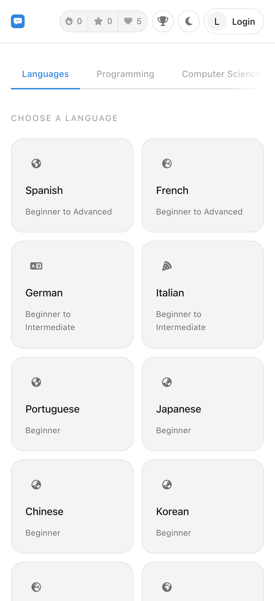
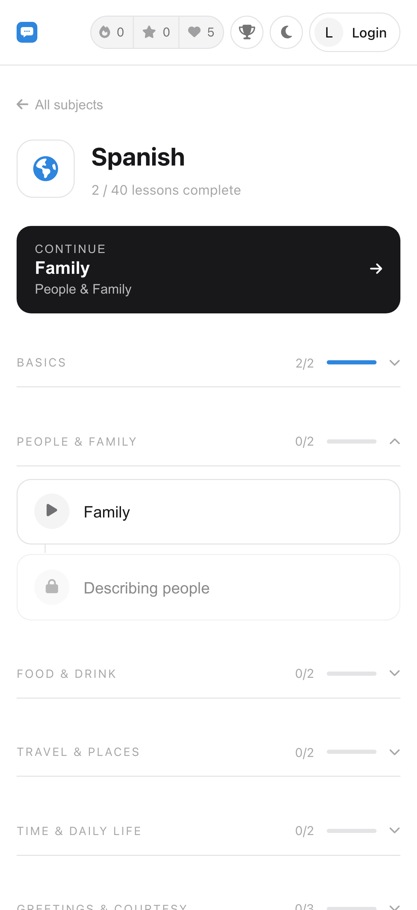

# Tonchi

[](LICENSE) [](https://apps.apple.com/app/id6783501611)

Learn a language, or anything else, five minutes at a time. Streaks, hearts, XP. Web, iOS, macOS and Apple Watch.

Live at [tonchi.heyitsmejosh.com](https://tonchi.heyitsmejosh.com) · [App Store](https://apps.apple.com/app/id6783501611)

<p>
  
  
</p>

## What is in it

- 100+ courses in tabs: Languages, Programming, Computer Science, Engineering, Math, Science, School, Skills
- Chess puzzles on a real board: mate in one and two, forks, pins, skewers and more
- Every lesson opens with a "Learn this first" card, then a quiz. Misses come back at the end and every answer says why
- Multiple choice, word bank, fill in the blank, matching pairs, listening, speech
- Spaced repetition, weak-word practice, a placement test, streaks, XP, achievements
- One Supabase account syncs progress across web, iOS, macOS and Watch

## Layout

```
index.html, app/        landing page and the web app (vanilla JS, no build step)
js/lingo-app.js         app state, auth, lessons
css/                    lingo.css and neutral.css (colours)
content/catalog.json    the course catalog
content/courses/        one JSON pack per course
scripts/                deploy.sh and the language-pack generator
tools/                  validators and mechanic checks
ios/ watchos/ kmp/      SwiftUI iOS and macOS, watchOS, Android
docs/                   API and architecture notes
```

## Run and deploy

```bash
npx serve .                      # run locally
node tools/validate-catalog.js   # check the catalog and every course
./scripts/deploy.sh              # publish to Cloudflare Pages (a git push does not deploy)
cd ios && xcodegen generate      # native projects
```

## More

[Architecture](docs/ARCHITECTURE.md) · [API and agent tools](docs/API.md) · [Whitepaper](WHITEPAPER.md) · [Roadmap](roadmap.md) · [Attribution](ATTRIBUTION.md)

Language sentences come from the [Tatoeba Project](https://tatoeba.org) (CC-BY 2.0 FR), ranked by [FrequencyWords](https://github.com/hermitdave/FrequencyWords) (MIT).
Courses Cruise has played (Greek, Polish, Hindi, Japanese, Korean, French and more) get up to 120 units, sized to how much it practised and ordered so sentences using the words it practised come first. Only the word list is read from Cruise; every sentence is Tatoeba.
Chess has 195 tactics puzzles on a real board, from the [Lichess puzzle database](https://database.lichess.org/#puzzles) (CC0). Each one is replayed with python-chess before it ships.
